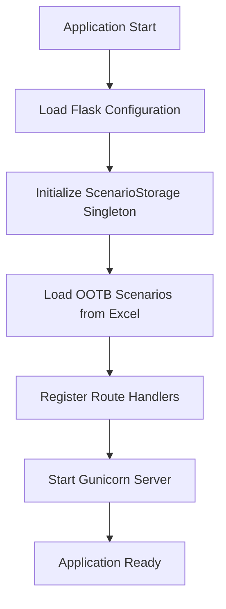
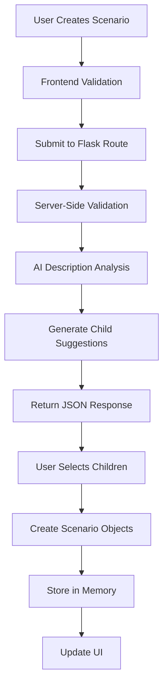
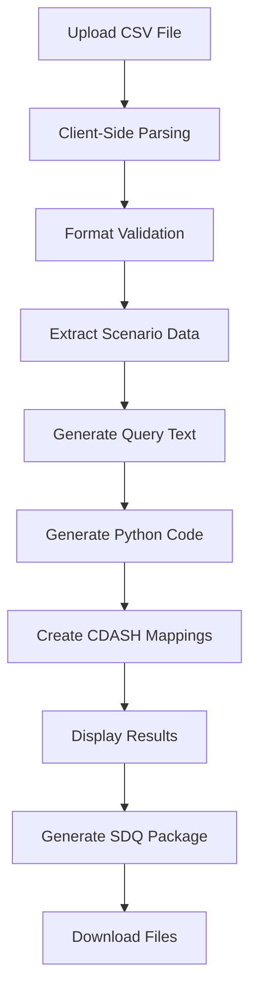

# QAD Scenario Management System - Technical Architecture

## 🏗️ System Architecture Overview

The QAD Scenario Management System follows a modular, layered architecture designed for pharmaceutical clinical data validation. The system combines traditional web application patterns with modern AI integration to provide comprehensive scenario management capabilities.

```
┌─────────────────────────────────────────────────────────────┐
│                    Presentation Layer                       │
├─────────────────────────────────────────────────────────────┤
│  Bootstrap 5 UI │ Vanilla JavaScript │ Jinja2 Templates    │
└─────────────────────────────────────────────────────────────┘
┌─────────────────────────────────────────────────────────────┐
│                    Application Layer                        │
├─────────────────────────────────────────────────────────────┤
│     Flask Routes │ Business Logic │ Session Management      │
└─────────────────────────────────────────────────────────────┘
┌─────────────────────────────────────────────────────────────┐
│                    Service Layer                            │
├─────────────────────────────────────────────────────────────┤
│  AI Generator │ Data Processing │ Export Services │ Validation│
└─────────────────────────────────────────────────────────────┘
┌─────────────────────────────────────────────────────────────┐
│                    Data Layer                               │
├─────────────────────────────────────────────────────────────┤
│  In-Memory Storage │ CSV Processing │ Excel Integration     │
└─────────────────────────────────────────────────────────────┘
┌─────────────────────────────────────────────────────────────┐
│                    External Services                        │
├─────────────────────────────────────────────────────────────┤
│      OpenAI GPT-4o API │ File System │ Environment Config   │
└─────────────────────────────────────────────────────────────┘
```

## 🔧 Core Components

### 1. Application Core (`app.py`)

**Purpose**: Flask application initialization and configuration management.

```python
# Core configuration
app = Flask(__name__)
app.secret_key = os.environ.get("SESSION_SECRET")
app.wsgi_app = ProxyFix(app.wsgi_app, x_proto=1, x_host=1)

# Database configuration (future-ready)
app.config["SQLALCHEMY_DATABASE_URI"] = os.environ.get("DATABASE_URL")
db.init_app(app)
```

**Key Responsibilities**:
- Flask application instance creation
- Environment-based configuration
- Database connection setup (PostgreSQL ready)
- Middleware configuration for deployment
- Session security management

### 2. Data Models (`models.py`)

**Architecture Pattern**: Dataclass-based modeling with type safety and validation.

```python
@dataclass
class ParentScenario:
    id: str
    name: str
    description: str
    is_active: bool
    is_ootb: bool
    child_scenarios: List[ChildScenario]
    tag: Optional[Tag]
    version: str = "1.0"
    created_at: datetime = field(default_factory=datetime.now)
    updated_at: datetime = field(default_factory=datetime.now)
```

**Design Principles**:
- **Immutable by Default**: Dataclass fields with validation
- **Type Safety**: Full type annotations throughout
- **Hierarchical Structure**: Parent-child scenario relationships
- **Metadata Tracking**: Version control and timestamp management
- **Tag System**: Single-tag categorization for simplicity

### 3. Business Logic Layer (`data.py`)

**Architecture Pattern**: Singleton storage with in-memory operations.

```python
class ScenarioStorage:
    _instance = None
    
    def __new__(cls):
        if cls._instance is None:
            cls._instance = super().__new__(cls)
        return cls._instance
```

**Key Features**:
- **Singleton Pattern**: Single source of truth for application data
- **In-Memory Operations**: Fast read/write operations for development
- **Search Optimization**: Multi-criteria filtering with O(n) complexity
- **Data Integrity**: Validation and constraint enforcement
- **OOTB Integration**: Pre-loaded clinical scenarios

### 4. AI Integration (`ai_generator.py`)

**Architecture Pattern**: Service-oriented AI integration with fallback mechanisms.

```python
class ScenarioGenerator:
    def __init__(self):
        self.client = OpenAI(api_key=os.environ.get("OPENAI_API_KEY"))
    
    def generate_child_scenarios(self, parent_name: str, parent_description: str) -> List[Dict]:
        # GPT-4o integration with medical context
        response = self.client.chat.completions.create(
            model="gpt-4o",  # Latest OpenAI model
            messages=[{"role": "system", "content": MEDICAL_CONTEXT_PROMPT}],
            response_format={"type": "json_object"}
        )
```

**Design Features**:
- **Medical Context Awareness**: Clinical domain-specific prompts
- **CDISC Compliance**: Automated CDASH variable mapping
- **Fallback Mechanisms**: Graceful degradation without AI
- **Response Validation**: JSON schema validation for AI responses
- **Error Handling**: Comprehensive exception management

### 5. HTTP Layer (`routes.py`)

**Architecture Pattern**: RESTful endpoints with session-based state management.

**Route Categories**:

```python
# Core CRUD Operations
@app.route('/')
@app.route('/scenarios/<scenario_id>/toggle', methods=['POST'])
@app.route('/scenarios', methods=['POST'])

# AI-Powered Endpoints
@app.route('/api/generate-scenario-metadata', methods=['POST'])
@app.route('/api/suggest-child-scenarios', methods=['POST'])
@app.route('/scenarios/<parent_id>/generate-children', methods=['POST'])

# File Processing
@app.route('/export/scenarios')
@app.route('/scenarios/dry-run/<scenario_id>')
```

**Design Principles**:
- **RESTful Design**: Standard HTTP methods and status codes
- **Session Management**: Flask session for temporary data
- **Error Handling**: Comprehensive exception management
- **JSON APIs**: Structured data exchange for AI features
- **File Operations**: Secure upload and download handling

## 🎨 Frontend Architecture

### 1. JavaScript Architecture (`static/js/app.js`)

**Pattern**: Module-based organization with event-driven interactions.

**Core Modules**:

```javascript
// Initialization Module
function initializeTooltips() { /* Bootstrap tooltip setup */ }
function initializeTableFunctionality() { /* Dynamic table behaviors */ }

// AI Integration Module  
async function generateScenarioNameAndTag(description) { /* OpenAI calls */ }
async function suggestChildScenarios() { /* Batch AI processing */ }

// File Processing Module
async function processDRPFile() { /* CSV parsing and validation */ }
function downloadSDQPackage() { /* Export generation */ }

// UI Management Module
function toggleChildScenarios(scenarioId) { /* Dynamic content */ }
function showToast(message, type) { /* User feedback */ }
```

**Design Features**:
- **Async/Await Pattern**: Modern JavaScript for API calls
- **Event Delegation**: Efficient DOM event handling
- **Progressive Enhancement**: Graceful degradation without JavaScript
- **Error Boundaries**: Comprehensive error handling and user feedback
- **Performance Optimization**: Debounced inputs and lazy loading

### 2. CSS Architecture (`static/css/style.css`)

**Pattern**: Component-based styling with Bootstrap extension.

```css
/* Component-Level Styling */
.scenario-card { /* Reusable scenario display */ }
.child-scenario-item { /* Child scenario styling */ }
.tag-badge { /* Consistent tag appearance */ }

/* Layout-Level Styling */
.main-container { /* Application-wide layout */ }
.tab-content { /* Tab system styling */ }

/* Interactive Elements */
.expandable-row { /* Dynamic table rows */ }
.loading-spinner { /* Async operation feedback */ }
```

**Design Principles**:
- **Bootstrap Extension**: Custom components that extend Bootstrap
- **Medical UI Standards**: Professional, clean interface design
- **Responsive Design**: Mobile-first approach with breakpoints
- **Accessibility**: WCAG-compliant color schemes and interactions
- **Performance**: CSS optimization for fast rendering

### 3. Template Architecture (`templates/`)

**Pattern**: Jinja2 component-based templating with inheritance.

```
templates/
├── base.html                 # Master template with common structure
├── index.html               # Main application template
└── components/
    ├── scenario_table.html   # Reusable scenario display
    ├── create_scenario_modal.html  # Scenario creation form
    ├── child_scenario_form.html    # Child scenario inputs
    └── drp_management.html    # DRP processing interface
```

**Template Features**:
- **Component Reusability**: Modular template components
- **Data Binding**: Dynamic content with Jinja2 expressions
- **Form Management**: Complex form handling with validation
- **Progressive Enhancement**: Server-side rendering with client-side enhancement

## 📊 Data Flow Architecture

### 1. Application Initialization Flow



### 2. Scenario Creation Flow



### 3. DRP Processing Flow



## 🔐 Security Architecture

### 1. Authentication & Authorization

**Current State**: Single-user application without authentication.
**Future Considerations**: 
- JWT-based authentication for multi-user scenarios
- Role-based access control for different user types
- Integration with enterprise SSO systems

### 2. Data Security

```python
# Session Security
app.secret_key = os.environ.get("SESSION_SECRET")

# Input Validation
@validate_csv_format
def process_drp_upload():
    # Comprehensive input sanitization
    
# API Key Management  
OPENAI_API_KEY = os.environ.get("OPENAI_API_KEY")
```

**Security Features**:
- **Environment Variables**: Secure secret management
- **Input Validation**: CSV and form data sanitization
- **Session Security**: Flask session encryption
- **File Upload Security**: Type and size validation
- **XSS Prevention**: Template escaping and validation

### 3. Error Handling & Logging

```python
# Comprehensive Error Handling
try:
    result = ai_generator.generate_child_scenarios(parent_name, description)
except OpenAIAPIError as e:
    logger.error(f"AI generation failed: {e}")
    return fallback_scenarios()
except Exception as e:
    logger.error(f"Unexpected error: {e}")
    return error_response("Processing failed")
```

## 🚀 Deployment Architecture

### 1. Development Environment

```yaml
Environment: Development
Server: Flask Development Server
Configuration:
  - DEBUG: True
  - Hot Reload: Enabled
  - Port: 5000
  - Host: 0.0.0.0
```

### 2. Production Environment

```yaml
Environment: Production  
Server: Gunicorn WSGI Server
Configuration:
  - Workers: Auto-scaling
  - Port: 5000
  - Bind: 0.0.0.0:5000
  - Reload: True (for development convenience)
  - Process Management: Systemd/Docker ready
```

### 3. Replit Deployment

```toml
# .replit configuration
[deployment]
run = "gunicorn --bind 0.0.0.0:5000 --reuse-port --reload main:app"
deploymentTarget = "autoscale"

[nix]
channel = "stable-24_05"
```

**Deployment Features**:
- **Auto-scaling**: Dynamic resource allocation based on load
- **Environment Management**: Secure secret handling
- **Port Management**: Automatic port assignment and routing
- **Health Checks**: Application health monitoring
- **TLS Termination**: HTTPS support via Replit infrastructure

## 📈 Performance Architecture

### 1. Frontend Performance

**Optimization Strategies**:
- **Lazy Loading**: Child scenarios loaded on demand
- **Client-side Filtering**: Instant search without server calls
- **Event Delegation**: Efficient DOM manipulation
- **CSS/JS Minification**: Reduced payload sizes
- **CDN Integration**: Bootstrap and Font Awesome via CDN

### 2. Backend Performance

**Optimization Strategies**:
- **In-Memory Storage**: O(1) access times for most operations
- **Singleton Pattern**: Single instance for data management
- **Batch Processing**: AI calls grouped for efficiency
- **Session Caching**: Reduced redundant processing
- **Async Operations**: Non-blocking AI generation

### 3. Scalability Considerations

**Current Limitations**:
- In-memory storage limits concurrent users
- Single-process architecture for current deployment
- File-based data persistence not implemented

**Future Scalability**:
- PostgreSQL integration for persistent storage
- Redis for session management and caching  
- Microservices architecture for component isolation
- Load balancing for multi-instance deployment

## 🔧 Integration Architecture

### 1. OpenAI Integration

```python
# AI Service Integration
class ScenarioGenerator:
    def __init__(self):
        self.client = OpenAI(api_key=os.environ.get("OPENAI_API_KEY"))
        
    def generate_child_scenarios(self, parent_name, parent_description):
        response = self.client.chat.completions.create(
            model="gpt-4o",  # Latest model (May 2024)
            messages=[
                {"role": "system", "content": MEDICAL_CONTEXT_PROMPT},
                {"role": "user", "content": scenario_prompt}
            ],
            response_format={"type": "json_object"}
        )
```

**Integration Features**:
- **Model Selection**: GPT-4o for latest capabilities
- **Context Management**: Medical domain-specific prompts
- **Response Validation**: JSON schema enforcement
- **Error Handling**: Graceful degradation on API failures
- **Rate Limiting**: Built-in OpenAI client rate limiting

### 2. File System Integration

```python
# CSV Processing Pipeline
def process_csv_upload(file_path):
    data = parse_csv_with_validation(file_path)
    scenarios = extract_scenario_data(data)
    enhanced_scenarios = generate_code_for_scenarios(scenarios)
    return create_downloadable_package(enhanced_scenarios)
```

**File Processing Features**:
- **Multi-format Support**: CSV, Excel (XLSX) file processing
- **Validation Pipeline**: Comprehensive format checking
- **Error Reporting**: Detailed validation feedback
- **Export Generation**: Multiple output formats (CSV, ZIP)
- **Memory Management**: Efficient large file handling

### 3. CDISC Standards Integration

**Standards Compliance**:
- **CDASH Variables**: Comprehensive variable mapping
- **Domain Standards**: AE, EX, LB, VS domain support  
- **Terminology**: CDISC-compliant naming conventions
- **Validation Rules**: Standards-based data validation
- **SDQ Integration**: Smart Data Quality package generation

## 🧪 Testing Architecture

### 1. Manual Testing Strategy

**Test Categories**:
- **Functional Testing**: All user workflows and features
- **Integration Testing**: AI service and file processing
- **UI Testing**: Cross-browser compatibility and responsiveness
- **Performance Testing**: Load testing with large datasets
- **Security Testing**: Input validation and XSS prevention

### 2. Validation Framework

```python
# Data Validation Pipeline
def validate_scenario_data(scenario):
    validators = [
        RequiredFieldValidator(),
        CDASHMappingValidator(), 
        DomainComplianceValidator(),
        QueryTextLengthValidator(max_length=300)
    ]
    
    for validator in validators:
        if not validator.validate(scenario):
            raise ValidationError(validator.error_message)
```

### 3. Quality Assurance

**QA Processes**:
- **Code Review**: All changes reviewed for medical accuracy
- **AI Response Validation**: Generated scenarios reviewed by clinical experts
- **Data Integrity**: End-to-end data flow validation
- **Performance Monitoring**: Response time and memory usage tracking
- **Error Tracking**: Comprehensive error logging and analysis

## 📋 Development Guidelines

### 1. Code Organization

```
├── Core Application
│   ├── main.py              # Entry point
│   ├── app.py               # Flask configuration
│   ├── routes.py            # HTTP handlers
│   └── models.py            # Data models
├── Business Logic
│   ├── data.py              # Storage management
│   ├── ai_generator.py      # AI integration
│   └── process_excel_data.py # Data processing
├── Frontend Assets
│   ├── static/
│   │   ├── css/style.css    # Styling
│   │   └── js/app.js        # Client logic
│   └── templates/           # HTML templates
└── Configuration
    ├── replit.md            # Project documentation
    ├── pyproject.toml       # Dependencies
    └── .replit              # Deployment config
```

### 2. Coding Standards

**Python Standards**:
- PEP 8 compliance for all Python code
- Type hints for all function signatures
- Comprehensive docstrings for public methods
- Error handling with specific exception types

**JavaScript Standards**:
- ES6+ features for modern browser support
- Async/await for all asynchronous operations
- JSDoc comments for complex functions
- Event delegation for dynamic content

**HTML/CSS Standards**:
- Semantic HTML5 elements
- Bootstrap component consistency
- Accessibility compliance (WCAG 2.1)
- Mobile-first responsive design

### 3. AI Integration Best Practices

**Prompt Engineering**:
- Medical domain context in system prompts
- Specific output format requirements
- Error handling and fallback scenarios
- Token usage optimization

**Response Validation**:
- JSON schema validation for AI responses
- Medical terminology verification
- CDISC compliance checking
- Quality scoring for generated content

## 🔮 Future Architecture Considerations

### 1. Database Migration

**Planned Migration Path**:
```python
# Current: In-memory storage
storage = ScenarioStorage()

# Future: PostgreSQL with SQLAlchemy
class ParentScenario(db.Model):
    __tablename__ = 'parent_scenarios'
    id = db.Column(db.String(36), primary_key=True)
    name = db.Column(db.String(200), nullable=False)
    # ... additional fields
```

### 2. Microservices Architecture

**Service Decomposition**:
- **Scenario Service**: Core scenario CRUD operations  
- **AI Service**: OpenAI integration and prompt management
- **File Service**: CSV/Excel processing and export generation
- **Validation Service**: CDISC compliance and data validation
- **User Service**: Authentication and authorization (future)

### 3. API-First Architecture

**RESTful API Design**:
```python
# Future API endpoints
GET    /api/v1/scenarios              # List scenarios
POST   /api/v1/scenarios              # Create scenario  
PUT    /api/v1/scenarios/{id}         # Update scenario
DELETE /api/v1/scenarios/{id}         # Delete scenario
POST   /api/v1/scenarios/{id}/generate # AI generation
```

---

**Document Version**: 1.0  
**Last Updated**: June 2025  
**Architecture Review**: Annual  
**Stakeholders**: Development Team, Clinical Operations, QA Team